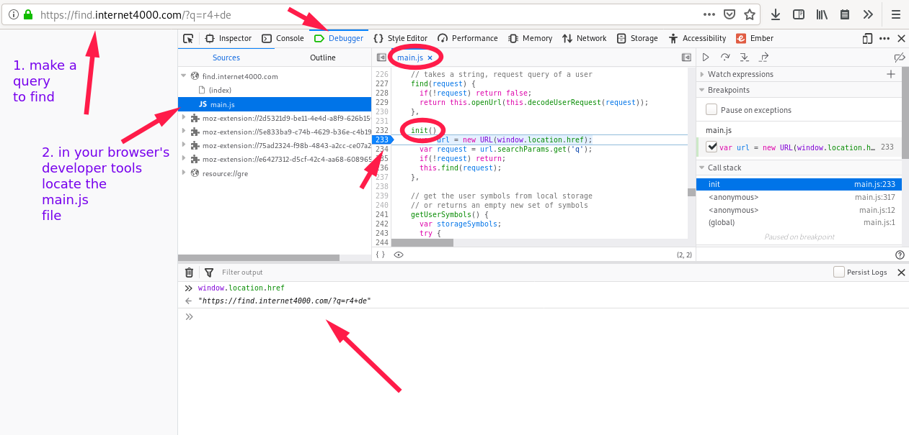

# Find
Web browser URL search engine utility to customize the omnibar actions.

It is built as a single importable file, without dependency, that can
run in web browsers and node.js javascript contexts.

It is distributed as [a
website](https://internet4000.github.io/find/), [javascript
class](https://github.com/internet4000/find/blob/main/src/index.js),
[npm package](https://www.npmjs.com/package/i4k-find) and [git
repository](https://github.com/internet4000/find).

To install and use a personal/community instance, follow the
installation/deployment guides.

## Browser search engine

To make Find the default search engine of a web browser:

1. Visit [a find instance homepage](https://internet4000.github.io/find)
2. Follow this [wiki how
   guide](https://www.wikihow.com/Change-Your-Browser%27s-Default-Search-Engine)
   for the specific device and browser

Alternatively, adding manually the search engine could be done with this open search browser config:

```
Search engine: `Find`
Keyword: `f`
Query URL: `https://internet4000.github.io/find/#q=%s`
```

3. Make the new Find search engine the default search engine (optional,
   recommended).
4. Now it should be possible to use the functionalities of Find in the URL bar of the web browser

> The mobile installation is not the easiest, but works on Firefox; web-browsers
> are making their bread and butter on the default search engines, and our
> queries; so they sometimes make changing it slightly annoying.

## Usage
All find "search queries" or "commands", are to be run in the browser
omnibox, or a find search input.

### Symbols

If the query we write in Find starts by one of these **symbols**, Find will try
to decrypt the user query to see if it can do something with it.

All available symbols are:

- `!` = search
- `+` = action
- `&` = build
- `#` = command (no custom engines)
- if there are no symbols, the query is forwarded untouched to the default search engine

Symbols are a way to give semantic meaning to engines. It should help
organize what the engines do, what parameter and query they can accept.

### Engines by symbols

For an up-to date list of default engines by symbols, look at the `index.js`
file.

All these symbols can be overwritten by the user, and new ones can be added.

#### ! search

These engines are stored under this `!` symbol, because they provide
search results, from your query.

- `!c <query>` - contacts.google.com
- `!d <query>` - duckduckgo.com
- `!dd <query>` - devdocs.io
- `!dr <query>` - drive.google.com
- `!m <query>` - maps.google.com
- `!osm <query>` - openstreetmap.org
- `!w <query>` - en.wikipedia.org
- `!y <query>` - youtube.com
- if unknown keyword - !keyword and queries fallback to default search
  engine, currently duckduckgo
- if nokeyword - search goes to default search engine

#### + action

These engines are stored under this `+` symbol, because they will allow you to
complete an action; add a item to a library, create a drawing, find a random
image or text etc.

- `+r4 [url]` - add a new track to a radio4000, from a youtube URL
- `+draw` - create a new drawing in tldraw
- `+doc [title]` - open a new Google Docs document
- `+sheet` - open a new Google Spreadsheets document
- `+gmail` - open a new Gmail (Google Mail) email
- `+wr` - random wikipedia article
- `+wri` - random wikipedia image media
- `+r4p` [radio] - play a radio4000 radio
- `+r4pr` [radio] - play a random track from a radio4000 radio

#### & build

These engines are stored under this `&` symbol, because the parameters
taken by the engines allows you to build complex URLs.

- `&gh [actor] [repo]` - github/[actor]/[repo]
- `&gl [actor] [repo]` - gitlab/[actor]/[repo]
- `&firebase [project]` - firebase/[project]
- `&netlify [project]` - netlify/[project]
- `&r4 [radio]` - radio4000/[radio]

#### # command

This is a special symbol, for command functions within find.

- `#add <symbol> <engine-id> <engine-url>`

adds a custom engine, by its `engine-id`, under a specific `symbol`

```
#add ! gh https://github.com/search?q=
```

- `#del <symbol> <engine-id>`

deletes a custom engine, by its `engine-id`, under a specific `symbol`

```
#del ! gh
```

### Update default search engine

It is possible to customize the default search engine used by find.

We have to overwrite the engine under the id `d` (`!d`; **d** for _default_).

For this we can use the following "find command", to make Google our default search engine.

```
#add ! d https://encrypted.google.com/search#q={}
```

To use these triggers, for exemple with the search query `foo`:

- Put the cursor in the URL bar of the web-browser
- Type the website's `!keyword` (the website on which you want to
  search. ex: `!y` for Youtube), prefixed with a `!`.
- After the keyword, add a `space` (just normally as in between two
  words), and type our _search query_, in this exemple we said
  `foo`
- At this point the URL bar should have this written in `!y foo` (there
  is a space in between `!y` and `foo`).
- Press `enter` (the return key), to validate our search.
- Now you should be on Youtube, with the search results for our
  search querry `foo`.

Note: in the exemple above `Find!` is considered to be our default
search engine. If it is not, and you use it as one of Firefox's "one click
search engine", or Chrome/Chromium's "other search engine", you have
to follow the same steps as above but as a first step you need to
_trigger the search `Find!` search engine_ ("Tab" key in Firefox /
"one space" in Chrome/ium, after writting the keyword).

### Add custom engines

The interest of Find is the possibility to add a custom engines,
and replace the default ones depending on our preferences.

There are different ways to add engines (works for all symbols, but `#`):

- `#add` command
- `Find` object in the browser console (Try: `Find.help()`)
- edit the code and host an instance

### Sync data between devices

to `sync` custom engines between devices, we use a trick with the password manager, and take advantage of the user usual way to synchronise credentials between their devices.

> This operation currently overwrites existing user defined engines, when
> importing new ones (in does not merge them).

1. save the "application data" (user defined engines and symbols), as a JSON string, into a password manager, for this "find instance" URL
2. in the other devices, import by "login in" this site (in the "sync section"), which will request the credentials for this site (actually the application data we just saved from our device).

The imported data, is written as the new user defined engines, and saved to local storage for this browser.

### `search` engine urls

1. Go to the website you would like to add and search for `foo` in the
   search input.
1. Wait for the search result to appear and copy the URL of the search
   result page, it should have `foo` in it (usually after a parameter
   called `q`, or `query`, but it could be a different pattern). Copy
   everything, from the `scheme://` to `foo` (excluded).

> Note that you can also use the information stored in the `.xml` file
> possibly used by websites to define their `Open Search
Description`. To do that, inspect the HTML code of the site you want
> to add and search for a HTML link tag with the folloing type:
> `application/opensearchdescription+xml"`. The file it points to will
> have the infortmation you are looking for in the `Url` XML tag.

### API(s)
Find has different interfaces, some of which can be used
programatically (better than others):

- through its URL: [internet4000.github.io/find/#q=[query]](https://internet4000.github.io/find/#q=[query]) with a Find search query
- through the `I4kFind` Javascript class exported by the package (and
  `.find("my query")` public method)
- through the graphical interface `./src/ui/index.js`, and all
  exported web-components
- through the `./service-worker.js` client side OpenSearch suggestions
  API (experimental; see development notes)

## Host a personal instance
1. deploy and host the site on a server
2. edit the file `assets/opensearch.xml` to fit the URL address of the
   instance

## Privacy
This software does not collect any data, there are and should be no
analytics functionalities on the user queries and usage.

It stores in the browsers local storage (could be improved, or
enhanced), only the user defined customization(s).

### (Privacy warning) Cloudflare analytics

There is a cloudflare analytics beacon.

It sends a HTTP get request, to cloudflare, to check if it can. If it
can, it warns the user that they should install a "blocker" with
instructions.

If the HTTP request succeeds (user has no advert blocker),
[Cloudflare](https://www.cloudflare.com/analytics/), eventually must
be saving the "request information", for a certain amount of time.

The user query is (and should) never be shared with Cloudflare, the
`#` param where the user request, always stays on the client side of
the browser.

It is used to warn the user:
- if the request goes through to cloudflare, that they should install
a advert-blocker. The resulting analytics of user who do not have
advertising de-activated, are stored in Cloudflare analytics, but will
never be used to process user data of any kind. Sometimes an admin
looks at the map to see where the request to the site comes from.
- if the request is rejected, it removes itself from the DOM (see
@TODO:flag-rm-analytics-beacon)

### About the hash parameter
When making a search to an instance of find, the user query is passed
to the client side application, and never to the server.

The query should never leave the user browser (and reach the server
hosting the site serving the Find webpage and code), [as it is passed
to the browser as value of the `hash` parameter](
https://en.wikipedia.org/wiki/URI_fragment).

This should help protect more the privacy of the user, as the value of
the `hash` parameter in a URL, does not "leak the user query" to the
server it is hosted on (or any third party; there are none, except the
Cloudflare beacon, which can be removed; @TODO: add flag to local
storage to not even insert; but need to define first user settings,
more than just the custom engines).

- Find uses the [hash](https://en.wikipedia.org/wiki/URI_fragment) `#`
  URL Search Parameter; uses `#q=`
- versus the [query](https://en.wikipedia.org/wiki/Query_string) `?`
  URL Search Parameter (do not use; it used to only handle `?q=`, but
  removed for the reason explained here; @TODO:rm-query-search-param
  currently left in as fallback for legacy migration; and maybe
  alternative entry point, somehow if some need)

## Debug this software (live, in the browser)
The easieset way to start debugging is from the developer tools of
a web browser. Because Find is unminified javascript code, it is
possible to look at what read what the code does and where it
fails. You can for example use a debugger to follow how a query is
translated.

From a browser we can look at it like so:

.

## Firefox notes

In firefox omnibar, we can use the prefixes:

```text
*  to search for matches in bookmarks
%  to search for matches in currently open tabs
^  to search for matches in browsing history
>  to search for marches in firefox actions
+  to search for matches in tagged pages
#  to search for matches in page titles
$  to search for matches in web addresses (URLs)
?  to search for matches in suggestions
```
