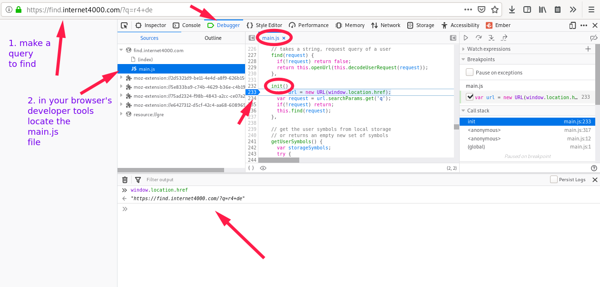

- npm: [i4k-find](https://www.npmjs.com/package/i4k-find)
- [internet4000.github.io/find](https://internet4000.github.io/find)

# Find!

> Note: there is no backend code in this project, only code running in the browsers

The URL bar of web-browsers is used to write websites adresses and
search queries. Find is a tool that offers a user the possibility to
customize these functionalities.
For this it uses [Open Search](https://en.wikipedia.org/wiki/OpenSearch)
and a small piece of Javascript.

It aims to be a simple way to enhance the URL bar user-experience,
easy to use and install. Also, it is Free software, and can be
customized and hosted quickly at your convenience.

The fastest way to test its features, is by trying the example queries
on this page: [try Find! here](https://internet4000.github.io/find).

If you want to have the best experience, try it as your web browser's
default search engine; so all the features are accesible directly in
your URL bar (tip: focus it with `C-l`).

> Note: the functionalities of the software are written in
> Javascript. All the code is in the `main.js` file and can be read in
> a few minutes. It is not minified when distributed to offer a
> possibility to be inspected freely. This software does not and
> should not store any user data.

A start to take control back over our inputs, and to get full
advantage about the URI system as a user on the web.

> Note: not all websites and applications with URLs offer
> functionalities directly from their URL, even though it is super
> nice.

## Usage example

```
!osm tokyo
!gh linux
+wr
+wri
&gh
&gh internet4000
&gh internet4000 find
+sheet
+draw hello world
```

Write the queries above in a Find input to see the result.
Read the rest of this document to epxlore more.

> There seems to be an issue with Firefox swallowing the `+` symbols (see https://github.com/internet4000/find/issues/50). As a quick fix alternative, use two `++`, such as `++wr` for a random wikipedia article.

## Setup details

This section shows you how to make Find your default browser search
engine. Skip it for usage details.

There are two possible setups:

- self hosted, where you host your instance of Find. It is all
  javascript running in the browser, so it is easy to host anywhere
  for free, and instance for your usage. It is the best for privacy,
  so you're sure of where your search queries are going. To learn more
  about this, go to the `Host your own instance` header
- use an instance hosted by someone else; this is the version
  proposed here, hosted from this repository to Netlify.

Overhall it is pretty easy, and is about making Find your default
search engine.

1.  Visit [internet4000.github.io/find](https://internet4000.github.io/find) with your favorite web browser

2.  Add this webpage as your search engine. Here is where how, with: \* _Firefox_, click the magnifying glass icon (it has a green "+") in
    the search bar, then click the `Add "Find!" button`. Check if it
    worked in your preferences (`about:preferences#search`), `Find!`
    should now appear in the "One-click search engines" list. You can
    double click its `Keyword` column to customize how it will be
    triggered, we recommand you to put the letter `f`, short for "find"
    (if you do not use it as default search engine).
    - For \*Chrome/Chromium\*, go to its settings page
      (`chrome://settings/searchEngines`); in the "Other search engines"
      section, click the "add" button and use the following values:

```
Search engine: `Find`
Keyword: `f`
Query URL: `https://internet4000.github.io/find/#q=%s`
```

3. Make the new Find search engine your default search engine.
4. Now you should be able to use the functionalities from your URL
   bar.

The mobile installation is not the easiest, but works on
Firefox; web-browsers are making their bread and butter on the default
search engines, and our queries.

## Usage details

By default (if you don't use any symbol prefix, or the one you use
does not exist), your search queries will go to
[DuckDuckGo](https://duckduckgo.com) ("the search engine that doesn't
track you").

> Note: it is possible and easy to change your default search engine,
> just overwrite the engine under the id `d` (`!d`; **d** for
> default). It is explained later, but for example your could write `#add !
d https://encrypted.google.com/search#q={}` to make Google your
> default search engine.

> the `?q=` query param is not suported any longer as input to the application
> for privacy reasons, as query params are sent to the server. Instead it now
> uses `#` prefixed data, that is not sent to the server (fragment identifier).

All the idea with Find is to use the following **symbols** and
**engines** in your search (and define your custom).

### Symbols

If what you write in Find starts by one of these **symbols**, Find
will try to decrypt your query to see if it can do something iwth it.

All available symbols are:

- `!` = search
- `+` = action
- `&` = build
- `#` = command (no custom engines)
- no symbol, your query goes untouched to the default search engine

Symbols are a way to give semantic meaning to engines. It should help
organize what the engines do, what parameter and query they can take.

Let's see what engines are available for each symbols.

### Engines by symbols

For an up-to date list of default engines by symbols, you can look at the
beginning of the `main.js` file. All the symbols and engines are
written the same way as in the following tables (but complete).

#### ! search

These engines are stored under this `!` symbol, because they provide
search results, from your query.

- !a - amazon.com
- !c - contacts.google.com
- !ciu - caniuse.com
- !d - duckduckgo.com
- !dd - devdocs.io
- !dr - drive.google.com
- !g - encrypted.google.com
- !lp - lpepfinder.com
- !m - maps.google.com
- !osm - openstreetmap.org
- !w - en.wikipedia.org
- !y - youtube.com
- unknown keyword - !keyword and queries fallback to default search
  engine, duckduckgo
- nokeyword - search goes to default search engine, duckduckgo

#### + action

These engines are stored under this `+` symbol, because they will
allow you to complete an action; add a music to your library, create a
drawing, find a random image or text etc.

- +r4 [url] - add a new track to your radio4000, from a youtube URL
- +draw [title] - open a new drawing in Google Drive Draw
- +doc [title] - open a new Google Docs document
- +sheet - open a new Google Spreadsheets document
- +gmail - open a new Gmail (Google Mail) email
- +wr - random wikipedia article
- +wri - random wikipedia image media
- +r4p [radio] - play a radio4000 radio
- +r4pr [radio] - play a random track from a radio4000 radio

#### & build

These engines are stored under this `&` symbol, because the parameters
taken by the engines allows you to build complex URLs.

- &gh [user] [repo] - github/[user]/[repo]
- &gl [user] [repo] - gitlab/[user]/[repo]
- &firebase [project] - firebase/[project]
- &netlify [project] - netlify/[project]
- &r4 [radio] - radio4000/[radio]

#### # command

This is a special symbol, for commands within find.

- #add \<symbol\> \<engine-id\> \<engine-url\> - add a custom engine,
  by its `engine-id`, under a specific `symbol`; e.g: `#add ! gh https://github.com/search?q=`

> question: does that represent a security issue?

### Detailed usage

To use these triggers, for exemple with the search query `foo`:

- Put your cursor in the URL bar of your browser
- Type the website's `!keyword` (the website on which you want to
  search. ex: `!y` for Youtube), prefixed with a `!`.
- After the keyword, add a `space` (just normally as in between two
  words), and type your _search query_, in this exemple we said
  `foo`
- At this point the URL bar should have this written in `!y foo` (there
  is a space in between `!y` and `foo`).
- Press `enter` (the return key), to validate your search.
- Now you should be on Youtube, with the search results for your
  search querry `foo`.

Note: in the exemple above `Find!` is considered to be your default
search engine. If it is not, and you use it as one of Firefox's "one click
search engine", or Chrome/Chromium's "other search engine", you have
to follow the same steps as above but as a first step you need to
_trigger the search `Find!` search engine_ ("Tab" key in Firefox /
"one space" in Chrome/ium, after writting the keyword).

## Add custom engines

The interest of Find is the possibility to add your custom engines,
and replace the default ones depending on your preferences.

There are different ways to add engines (works for all symbols, but `#`):

- `#add` command
- `Find` object in the browser console (Try: `Find.help()`)
- edit the code and host an instance

If there is an issue, it is possible to "clear the user engines with the
browser console command:

```javascript
localStorage.setItem(Find.localStorageKey, JSON.stringify(Find.newUserSymbols));
```

## sync

to `sync` custom engines between devices, we use a trick with the password manager, and take advantage of the user usual way to synchronise credentials between their devices.

> This operation currently overwrites existing user defined engines, when
> importing new ones (in does not merge them).

1. save the "application data" (user defined engines and symbols), as a JSON string, into your password manager, for this "find instance" URL
2. in the other devices, import by "login in" this site (in the "sync section"), which will request the credentials for this site (actually the application data we just saved from our device).

The imported data, is written as the new user defined engines, and saved to local storage for this browser.

### `search` engine urls

1. Go to the website you would like to add and search for `foo` in the
   search input.
1. Wait for the search result to appear and copy the URL of the search
   result page, it should have `foo` in it (usually after a parameter
   called `q`, or `query`, but it could be a different pattern). Copy
   everything, from the `scheme://` to `foo` (excluded).

> Note that you can also use the information stored in the `.xml` file
> possibly used by websites to define their `Open Search
Description`. To do that, inspect the HTML code of the site you want
> to add and search for a HTML link tag with the folloing type:
> `application/opensearchdescription+xml"`. The file it points to will
> have the infortmation you are looking for in the `Url` XML tag.

## API

Find has a few APIs:

- through its URL: [internet4000.github.io/find/#q=[query]](https://internet4000.github.io/find/#q=[query])
- through the `Find` Javascript object (try in the console `Find.help()`)
- through the web component graphical interface `./find-elements.js`

## NPM Module

Find is available as a NPM module [!npm i4k-find](https://www.npmjs.com/package/i4k-find).

You can see and example usage in [&gh internet4000 find](https://github.com/internet4000/find).

## Host your own instance

1. deploy and host the site on your server
2. edit the file `opensearch.xml`, the line `<Url type="text/html"
template="https://internet4000.github.io/find/#q={searchTerms}"/>`, should be
   updated to reflect where you site will be hosted.

This website (internet4000.github.io/find) is hosted by [Netlify](https://www.netlify.com/), auto
deployed when new commits are pushed to the `production` branch of this
git repository.

## Privacy

This software does not collect any data, there are and should be no analytics
functionalities.

## License

The code of this software uses the [GNU General Public License
v3](https://www.gnu.org/licenses/gpl.html), which makes it [Free
software](https://en.wikipedia.org/wiki/Free_software).

## Debug this software (live, in the browser)

The easieset way to start debugging is from the developer tools of
your web browser. Because Find is unminified javascript code, it is
possible to look at what read what the code does and where it
fails. You can for example use a debugger to follow how a query is
translated.

All the code, in this repository and on a version hosted on a server,
is located in the `main.js` file.

From your browser you can look at it like so:

.

## Development

You don't need a development server to test and improve this software.

- get all the code (clone or download this repository)
- open the index.html in your web browser

Alternatively, a node server for development and testing can be used:

- `npm install` to get the development dependencies (there are and
  should be no production dependencies)
- `npm start` to run the local server

All the code is located in the file `main.js`. Other files are
configuration files for the continous integration, testing, opensearch,
hosting.

## Testing

- `npm test` runs tests once
- `npm run test-watch` open the testing interface and rerun on file change

Tests are located in the `cypress/integration` folder.

## Disclaimer

This version is a pure frontend written in Javascript. It is super
easy to host and deploy, but one of the downside is speed, even though
after the first visit the complete code should be cached by the browser.

If a similar code were to be implemented on the server side, there
would be one less client request, but it would be less transparent,
harder to host, deploy, and audit which information the server
stores.

This project is a vague and general experiment on the possible
improvements to the URL bar user experiences. More generally to the
user input spaces with written terminal interactions, such as CLIs
(Command-line interfaces), the shell, dmenu, HTML inputs and search
bars. This project is also inspired by Chrome/Chromium's Omnibox TAB trigger, Firefox's
custom search UX (keyword + space) and DuckDuckGo's !bangs action.

Chrome/Chromium refers to it as the Omnibox. Omni, Latin prefix
for "all" or "every", since we use it to _input everything_.

Self host your instances, customize your keywords, try out new
semantics, organizations and logic.

Hopefully it gives to control back to the user into what this URL bar
con do, and where the inputs go.
